# Kalman_adaptive_filter
 Реализация и теоретические аспекты Калмановской фильтрации

# Ресурсы про Калмана 

- [Фильтр калмана простыми словами](https://mp-lab.ru/filtr_kalmana_dlya_nachinayushchih/)
- [Статья с примерами реализации фильтра Калмана. Так же есть пример симуляции измерений](https://habr.com/ru/companies/singularis/articles/516798/)
- [Обяснение Фильтра Калмана в Картинках. Пояснена сама суть фильтра](https://habr.com/ru/articles/594249/)
- [Статья с мат. описание AEKF](Литература/AEKF.pdf)

# Приведу пример тестовой задачи

Итак рассмотрим следующую задачу:
Имеется канал, среда в поперечном сечении явлается однородной. Пусть на левой границе в точке x = 0, проосходит почтоянный сброс загрязнающего вещества - ГУ Дирихле $c(0,t)=C_0$. 

На левой границе поток проходит без сопротивления (ГУ Неймана $\frac{\partial c}{\partial x}\Big|_{x =L} = 0$). 

В начальный момент времени концентрация загрязнающих веществ равна $c(x, 0) = C_0\delta(x)$ 

Данный процесс описывается уравнением в частных производных (уравнение конвекции-диффузии):

$$
\frac{\partial c}{\partial t} = D\frac{\partial^2 c}{\partial x^2} - v\frac{\partial c}{\partial x}
$$

Источников загрязнения, стоков внутри области нет. 

И для применения фильтра Калмана нам нужно в данном случае каким-либо образом получить матрицу процесса $F$. Так же нужно определить, что в данной задаче явлается пространством состояний. А так же выбрать схему дискретезации уравнения. 

## Дискретизация уравнения
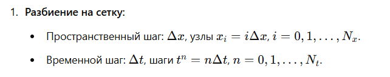
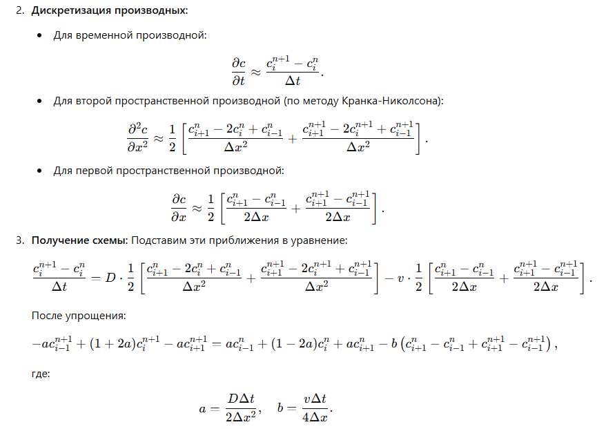

### Получение СЛАУ (раздел для душных)
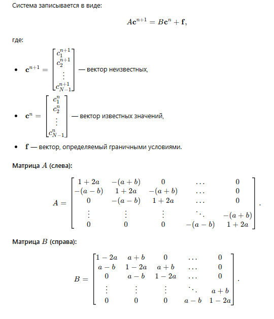
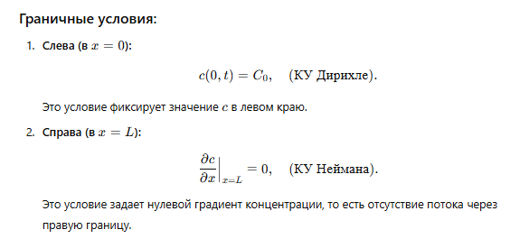
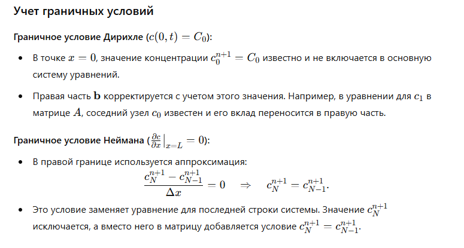
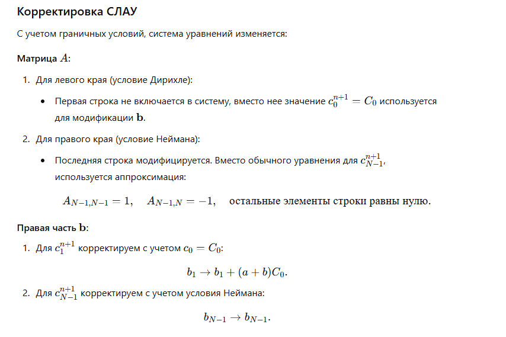
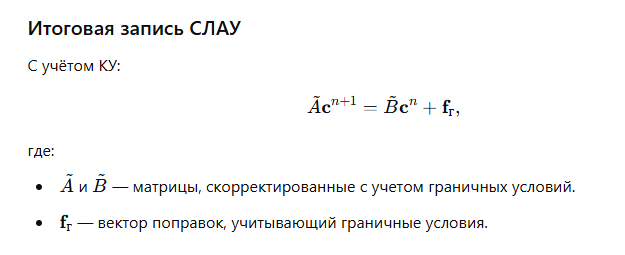
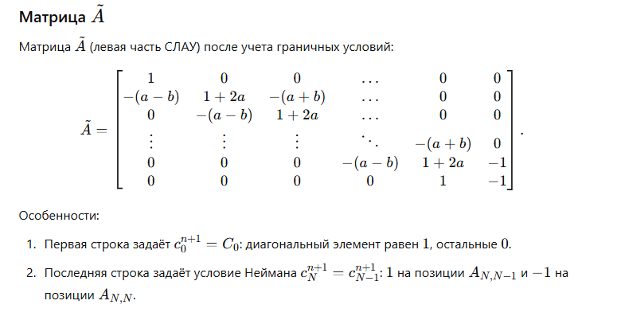
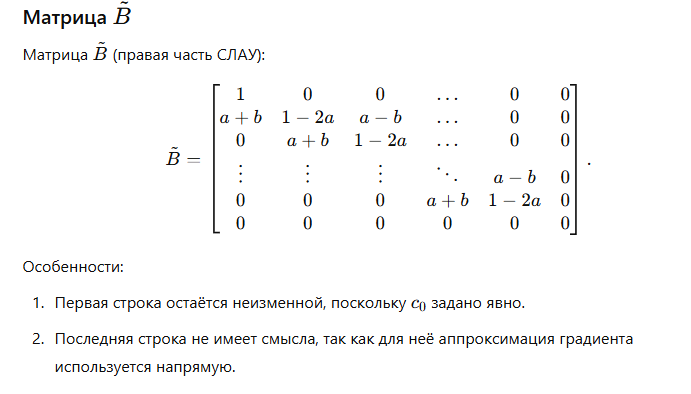

## Пространство состояний
Итак пусть пространство состояний - это вектор $\mathbf{c}^{n} = [c_{0}^n,c_{1}^n,..,c_{N}^n,]^T$ - концентрация вещества в момент времени $t^n = n\Delta t, n = 0,1,...,N_{t}$
Вектор состояний будем получать, как измерения концентрации вещества в точках пространства, а модельные данные из решения СЛАУ. 

## Постановка задачи с применением Фильтра Калмана
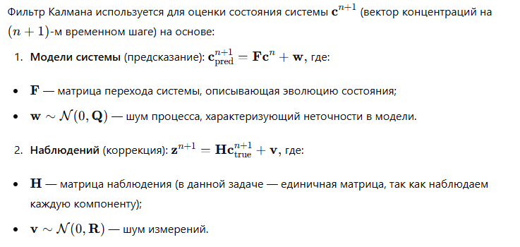

Далее остается вопрос откуда взять матрицу перехода, для данной задачи, это можно сденлать так:
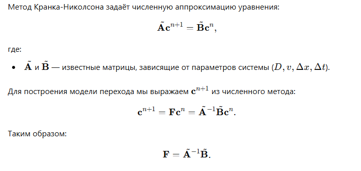

Дальше алгоритм фильтрации остается без изменений. 
